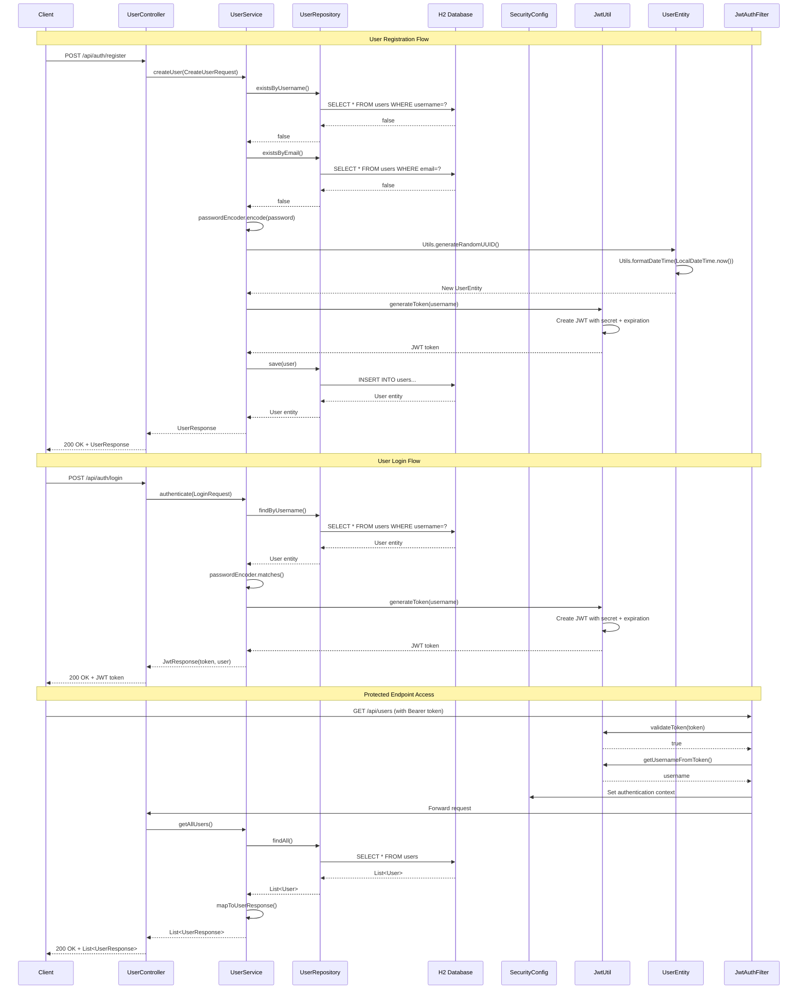

# Proyecto Spring Boot con Autenticación JWT

Este proyecto es una API REST desarrollada con Spring Boot que implementa autenticación JWT (JSON Web Tokens) para la gestión de usuarios.
Tambien implementa una serie de validaciones y condiciones que deben cumplir los campos de registro del usuario, como el largo del nombre, que exista un formato especifico para la creacion del email, el manejo personalizado de Excepciones con Spring y la anotacion @RestControllerAdvice.

## Características principales

- Registro y autenticación de usuarios
- Generación y validación de tokens JWT
- Endpoints protegidos por roles/autorizaciones
- Base de datos H2 embebida (para desarrollo)
- Configuración y Validación de Excepciones con Response personalizadas 
- Configuración de seguridad con Spring Security
- Mapeo automático DTO <-> Entidad

## Diagrama de Secuencia

El siguiente diagrama muestra los flujos principales de la aplicación:

## Diagrama de Estructura (Arquitectura en Capas)

## Reporte de Porcentaje de Coverage Test del Proyecto

El reporte completo se puede obtener corriendo el siguiente comando: ./gradlew clean test

